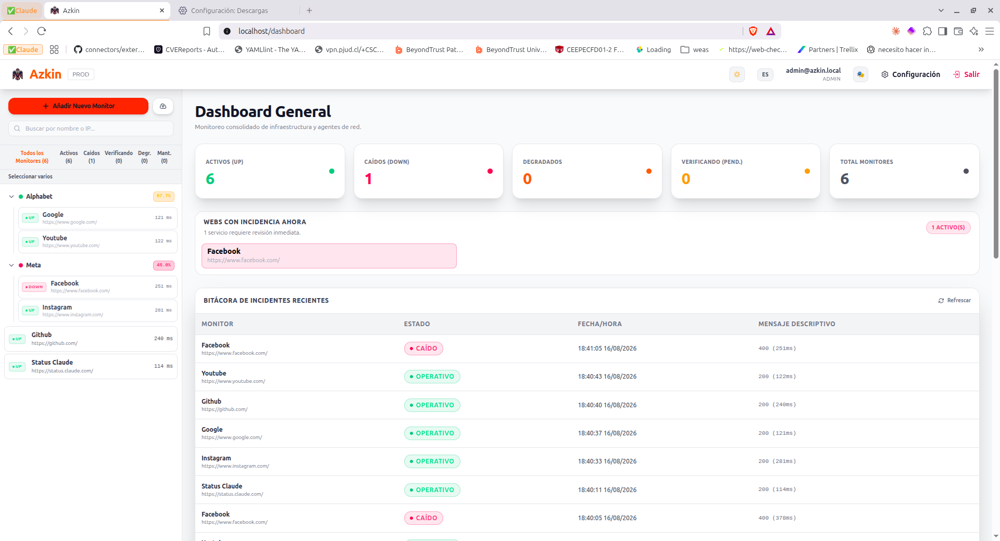
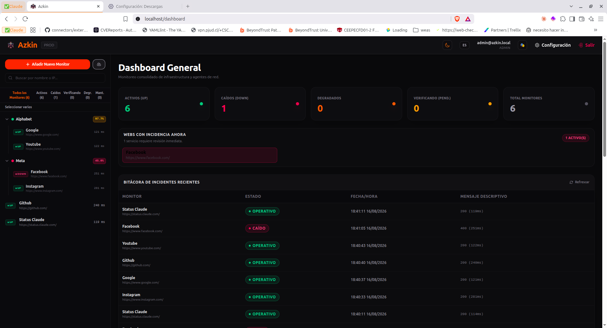
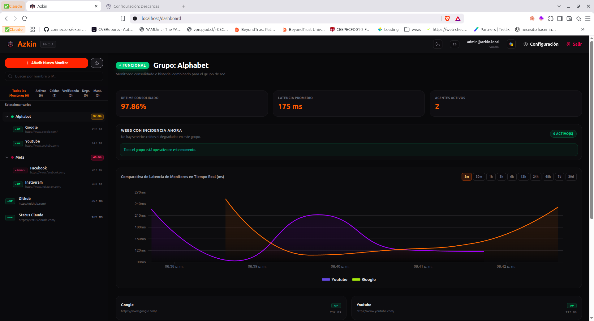
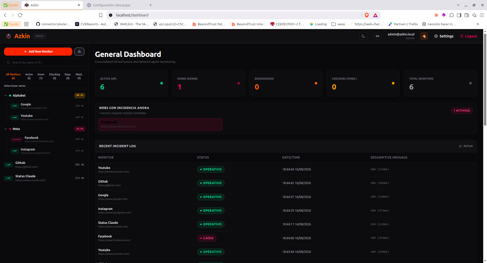
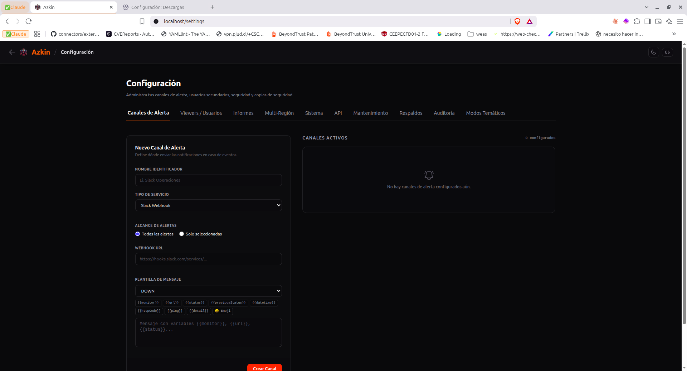
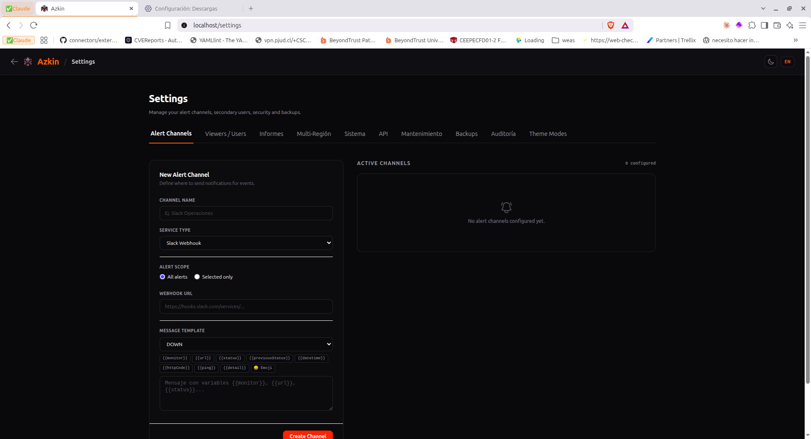
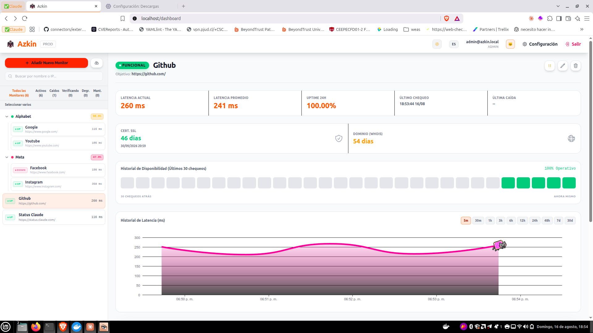
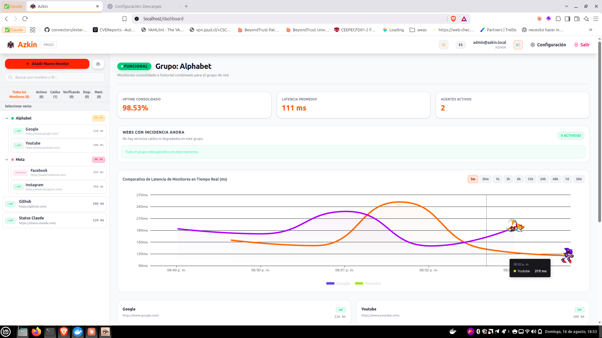
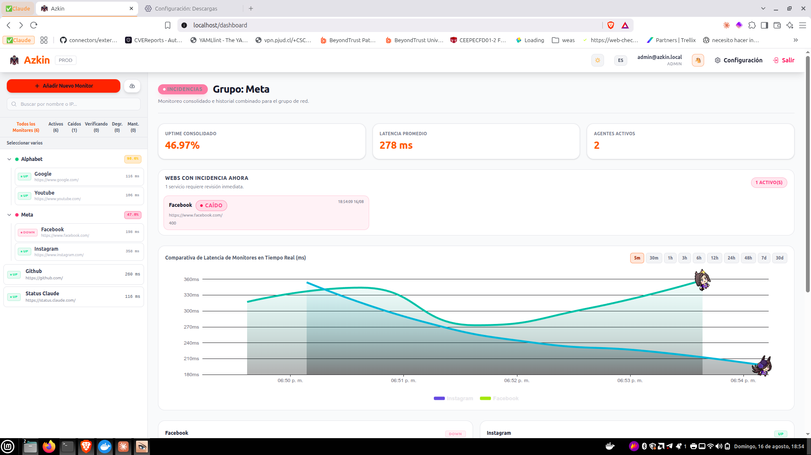

# <p align="center"></p>

# <p align="center">Azkin</p>

<p align="center">
  <strong>Professional real-time monitoring and network services platform.</strong>
</p>

<p align="center">
  <a href="./README.md">🇪🇸 Español</a> | 🇬🇧 English
</p>

> 🗿 **The name:** **Azkin** (from Mapudungun **azkintun**) means to look into the distance, to contemplate the horizon, to peer out or watch from a lookout point — exactly what this platform does with your services.

---

## 🚀 Overview

**Azkin** is a solution for monitoring the availability, integrity, and performance of web services and networks in real time.

> 📚 **Plain-language explanation**

## This thing is built to instantly track the uptime of multiple pages, services and networks, see when something goes down (downtime), how long it takes to respond (latency), and get real-time alerts so you can react fast without guessing what went wrong.

The platform supports multiple types of checks:

- **HTTP/HTTPS:** Latency, response codes, keyword validation (presence/absence), and smart **Cloudflare WAF** detection/bypass.
- **Ping (ICMP):** Status check at the network layer.
- **Port (TCP/UDP):** Generic socket monitoring — IP/hostname + port + protocol — for internal services with no web interface (SSH, RDP, SMB, or any one-off case).
- **DNS Resolver:** Active DNS query (A, AAAA, CNAME, MX, TXT records) against a specific server — confirms an internal or external DNS server actually resolves names, not just that it answers ping.
- **Passive Push:** Passive agent (remote heartbeat toward Azkin).
- **SNMP (v1/v2c/v3):** Advanced OID reading for network equipment.
- **24h Uptime:** Percentage availability calculation per monitor and per group for operational tracking.

For a detailed design of the Clean Architecture, how the Cloudflare WAF bypass works, Theme Modes, and data modeling, see the [Azkin Architecture Documentation](./docs/ARCHITECTURE.md).
To integrate external systems (Grafana, scripts, CI/CD) without using a user session, see the [Public API Documentation](./docs/api-publica.md).

> ⚠️ **Status: Beta.** Azkin is under active development. The core features run stably in daily use, but the following still need deeper testing: edge cases across the different monitor types (SNMP, Passive Push, DNS), high volumes of concurrent monitors, and several admin flows (Viewers, backups, TLS) under real production conditions. There is no automated frontend test runner yet (see [ISSUES.md](./ISSUES.md),). Please report any bug you find.
>
> 🚧 **Recently implemented, under validation:** federation of up to 5 independent Azkin instances across different geographic locations (token-based enrollment, mTLS communication with self-signed certificates, periodic polling, and a "By region/Combined" view), to compare the status of the same service as seen from multiple regions without depending on a central server. Verified end-to-end locally; still pending real production use. Details in [ISSUES.md](./ISSUES.md),  and [`docs/ARCHITECTURE.md`](./docs/ARCHITECTURE.md) §14.

---

## ✨ Key Features

- **Multi-admin without tenant isolation:** all Admins share the same pool of monitors, notification channels, and backups; any Admin can edit, reset the password of, lock, or delete another Admin's account from `/settings` (with self-lock/self-delete protection).
- **Viewers with granular permissions:** read-only accounts with access to "everything," a specific group, or a single monitor; includes an extended-session mode (TV/Kiosk) with a 1-year token and a UI with larger fonts/spacing for big screens.
- **Public API with API Keys:** integrate Azkin with external systems via `X-API-Key` (`read`/`write` scopes), without relying on a user session. See [`docs/api-publica.md`](./docs/api-publica.md).
- **Bulk monitor import (CSV):** drag-and-drop upload with per-row error reporting, without discarding the rest of the batch when a row is invalid.
- **DEGRADED status and adaptive monitoring:** an HTTP monitor responding with high latency, or that is down but whose host is still alive at the network level (ping/TCP), is distinguished from a total outage instead of being marked as pure DOWN; while DOWN or DEGRADED, the check interval automatically speeds up until it recovers. Thresholds configurable from `/settings`.
- **Maintenance module:** alert-silencing windows with granular scope (everything, a group, or specific monitors) and scheduled or immediate mode — the real heartbeat keeps being recorded, only notifications are suppressed while the window is active.
- **Extended audit history:** logging and querying from `/settings` of administrative action types (login attempts, CRUD on monitors/notifications/viewers/admins/API Keys/maintenance), with detail on which fields changed in each edit.
- **Multichannel notifications with templates:** email, Slack, Discord, Telegram, and generic webhooks, with configurable templates per event type, a clickable variable cheatsheet, and an emoji picker.
- **Secure session:** the access token lives in memory (never in `localStorage`); the session is renewed via an `HttpOnly` refresh cookie, rotated on every use. Each token carries a `typ` claim (`access`/`refresh`) that prevents using one in place of the other, and locking/deleting an account cuts off its access on the next request (no need to wait for the token to expire on its own).
- **Security hardening:** a batch of fixes from a full security audit — restored TLS certificate validation in email alerts, current password required to change your own and IDOR protection when resetting another Admin's password, HTML/JSON/Markdown escaping in reports and notifications, CSV formula-injection neutralization, masked SNMP credentials for Viewers, security headers (`helmet`), and a non-root backend container. Full details in [`ISSUES.md`](./ISSUES.md).
- **Theme Modes (plug-in):** a configurable easter egg — each mode is a folder of GIFs (`assets/huevo/<id>/`) discovered live by the backend, no rebuild or redeploy needed to add a new one. On a group chart, each monitor draws a different GIF from the active mode instead of always repeating the same one, prioritizing down/degraded monitors. Admins can enable/disable modes from `/settings`.
- **DNS Diagnostic Tool:** a one-off query from the navbar (forward and reverse resolution, with an optional DNS server to query against) to check a single DNS server on the fly without creating a monitor — persists nothing, available to any logged-in role.

---

## 📸 Screenshots

<table>
  <tr>
    <td align="center" width="50%">
      
      <br/><strong>General Dashboard — light mode</strong>
    </td>
    <td align="center" width="50%">
      
      <br/><strong>General Dashboard — dark mode</strong>
    </td>
  </tr>
  <tr>
    <td align="center" width="50%">
      
      <br/><strong>Group view — real-time latency comparison</strong>
    </td>
    <td align="center" width="50%">
      
      <br/><strong>Multi-language support (Spanish/English)</strong>
    </td>
  </tr>
  <tr>
    <td align="center" width="50%">
      
      <br/><strong>Configuración — same panel, in Spanish</strong>
    </td>
    <td align="center" width="50%">
      
      <br/><strong>Settings — alert channels, viewers, maintenance, Theme Modes and more</strong>
    </td>
  </tr>
</table>

### 🎭 Theme Modes in action

Each mode draws a different GIF per monitor within the same group chart — no more seeing the same character repeated on every line.

<table>
  <tr>
    <td align="center" width="33%">
      
      <br/><strong>NyanCat</strong> (the classic)
    </td>
    <td align="center" width="33%">
      
      <br/><strong>Sonic</strong> — a different character per line
    </td>
    <td align="center" width="33%">
      
      <br/><strong>Uma Musume</strong> — same idea, another GIF set
    </td>
  </tr>
</table>

---

## 🛠️ Tech Stack

- **Frontend:** Angular 21 (Signals, Standalone Components, ECharts, Tailwind CSS).
- **Backend:** Node.js (>= 24.13.0) + Express 5.x + TypeScript (Strict).
- **Database:** MongoDB 8.x + Mongoose (Time-Series collections with TTL).
- **Infrastructure:** Docker & Docker Compose.
- **Package Manager:** pnpm (>= 11.21.0).

---

## 💻 System Requirements

Calculated from the project's actual architecture (3 containers: `azkin-db`, `azkin-back`, `azkin-front`), not generic figures.

| Resource         | Minimum                                                                                                                      | Recommended                                                                           |
| ----------------- | --------------------------------------------------------------------------------------------------------------------------- | ------------------------------------------------------------------------------------- |
| Operating System  | 64-bit Linux x86-64/ARM64, or Windows/macOS with Docker Desktop                                                             | 64-bit Linux (Ubuntu 22.04+/Debian 12+), x86-64-v2 or ARM64                           |
| CPU                | 2 vCPU                                                                                                                      | 4 vCPU                                                                                |
| RAM                | 2 GB                                                                                                                        | 4-8 GB                                                                                |
| Storage            | 5 GB free                                                                                                                   | 20 GB+ on SSD                                                                         |
| Network            | Outbound internet for HTTP/ICMP/TCP/DNS/SNMP and notifications; inbound only on the frontend port (see details below)      | Same + low internal latency (already covered by `azkin-network`)                      |
| Software           | Docker Engine 24+ and Docker Compose v2                                                                                    | Docker Engine 24+ and Docker Compose v2                                               |
| Supported scale    | ~20-30 monitors, interval ≥ 60 s, one Admin                                                                                | Dozens-hundreds of monitors, default concurrency (`AZKIN_CHECK_CONCURRENCY=50`)       |

**Technical notes** (measured directly in this repo with `docker build` / `docker image inspect`):

- The 3 Docker images (`azkin-back` ~83 MB + `azkin-front` ~27 MB + `mongo:8` ~341 MB) add up to ~450 MB on disk.
- MongoDB reserves ~50% of (RAM − 1 GB) for its WiredTiger cache: with 2 GB it self-limits to ~512 MB; with 8 GB it goes up to ~3.5 GB.
- Each Ping monitor spawns a native `ping` subprocess per check, and the engine runs up to 50 checks in parallel by default — that's where most of the CPU usage comes from, not the Node process itself.
- Heartbeats live in a Time-Series collection with a 30-day TTL (self-purging). Worst case measured: ~650 MB/month with 50 monitors at the minimum interval (20 s).
- Node.js `>= 24.13.0` / pnpm are only needed if developing outside Docker; to run Azkin with `compose.yaml` nothing else needs to be installed on the host.
- **Network requirements (what to ask your Networking team for):** full table of inbound/outbound ports, protocols per monitor type, and per notification channel in [`docs/instalacion-docker.md`](./docs/instalacion-docker.md) §12.

---

## 📂 Repository Structure

- **[frontend](./frontend)**: Modern SPA client built with Angular 21, featuring a real-time dashboard, comparative latency charts, an availability block heatmap, and premium settings administration.
- **[backend](./backend)**: REST API / WebSockets server with a concurrent monitoring engine using bounded queues, a retry state machine, and multichannel notifications.

---

## 📚 Documentation

| Document                                                    | Content                                                                                                                                       |
| ------------------------------------------------------------ | ------------------------------------------------------------------------------------------------------------------------------------------- |
| [docs/instalacion-docker.md](./docs/instalacion-docker.md)  | Docker installation manual: environment variables, production, hot-reload development, HTTPS (terminated at nginx), backups, common issues. |
| [docs/ARCHITECTURE.md](./docs/ARCHITECTURE.md)               | Clean Architecture, Cloudflare WAF bypass, Theme Modes, authentication, public API, auditing.                                                |
| [docs/api-publica.md](./docs/api-publica.md)                 | `X-API-Key` authentication, available endpoints, key management, `curl` examples.                                                            |
| `spec/` (local, not versioned in git)                        | Functional specifications by phase (Spec-Driven Development): data model, API contracts, architecture.                                       |
| [CHANGELOG.md](./CHANGELOG.md)                                | Version history (Keep a Changelog + SemVer).                                                                                                  |
| [ISSUES.md](./ISSUES.md)                                      | Backlog of bugs, technical debt, and audit findings, with their documented resolution.                                                       |
| `.env.example` / `backend/.env.example`                      | Complete reference of supported environment variables.                                                                                        |

*Note: the documents above are currently maintained in Spanish only.*

---

## ⚡ Quick Start (Docker)

The platform is fully containerized. Docker container names are standardized as `azkin-front`, `azkin-back`, and `azkin-db`, connected to each other by a dedicated Docker network (`azkin-network`); the backend always talks to MongoDB over that internal network, never through a host port. MongoDB also publishes a host port for direct debugging only (Compass, mongosh), but bound to `127.0.0.1` with a configurable port number (`AZKIN_MONGO_PORT`) so it doesn't clash with other projects on the same server.

```bash
cp .env.example .env        # adjust credentials before bringing up the environment

# Everything in one command
git pull origin main && docker compose build --no-cache && docker compose up -d

# Production: Web on :80, API on :3000 (MongoDB internal only + 127.0.0.1:27017 for debug)
docker compose build --no-cache && docker compose up -d

# Development with hot-reload (Web on :4200)
docker compose -f compose.dev.yaml build --no-cache && docker compose -f compose.dev.yaml up -d
```

Full guide (environment variables, verification, HTTPS, backups, common issues) in [`docs/instalacion-docker.md`](./docs/instalacion-docker.md).

---

## 🛡️ Security and Auditing

This space is configured under strict security standards and is used exclusively for authorized monitoring and perimeter security / network availability audits.

_Designed under Clean Architecture and Spec-Driven Development principles._

---

## 🏷️ Versions and Tags

Azkin follows **Semantic Versioning** and publishes releases in `CHANGELOG.md`.
The recommended Git tag convention is:

- `vMAJOR.MINOR.PATCH` (example: `v1.0.0`)

Useful commands to view versions by tag:

```bash
# list tags
git tag

# list tags with their message/annotation
git tag -n

# view details of a specific version
git show v1.0.0

# compare two versions
git diff v1.0.0..v1.1.0
```

Recommended relationship between artifacts:

- Every release in `CHANGELOG.md` should have a corresponding Git tag.
- If Docker images are published, use the same version tag (e.g. `v1.0.0`) to maintain traceability.
