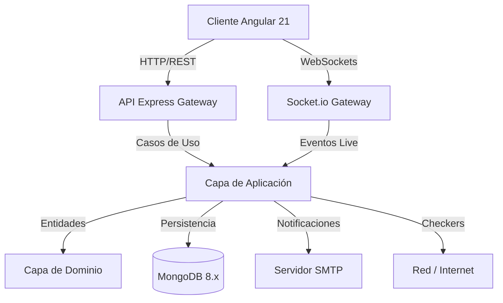
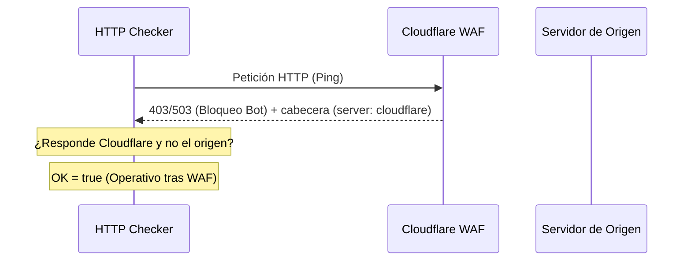

# Documentación Técnica de Azkin

Este documento detalla la arquitectura, el diseño del sistema y el funcionamiento de los componentes clave de **Azkin**.

---

## 🏛️ Arquitectura General

Azkin está diseñado bajo los principios de **Clean Architecture** en el backend y **Arquitectura Reactiva Declarativa (Signals)** en el frontend.



---

## 1. Backend: Clean Architecture & DDD

El backend está estructurado en capas desacopladas para facilitar la testabilidad y el mantenimiento:

### Capa de Dominio (`src/domain`)
* Contiene el núcleo del negocio libre de dependencias externas (sin frameworks ni ORMs).
* **Entidades:** `User`, `Monitor`, `Heartbeat`.
* **Value Objects:** `MonitorStatus` (UP, DOWN, PENDING) y `MonitorType` (http, ping, port, dns, push, snmp).
* **Errores de Dominio:** Base común para manejar excepciones de negocio con traducción HTTP directa.

### Capa de Aplicación (`src/application`)
* Orquesta el flujo de datos desde y hacia el dominio.
* **Casos de Uso:** Registro, Login, CRUD de Monitores, obtención de estadísticas e históricos.
* **Motor de Ejecución (`ExecuteCheck`):** Evalúa el estado de red de cada monitor. Posee una lógica de reintentos configurables e intervalo de reintento antes de declarar un estado `DOWN` definitivo.
* **Puertos:** Interfaces de los repositorios y servicios externos (SMTP, sockets).

### Capa de Infraestructura (`src/infrastructure`)
* Implementa las interfaces de la capa de aplicación con tecnologías específicas:
  * **Persistencia:** Mongoose con MongoDB 8. Colección `Heartbeat` optimizada como *Time Series Collection* con TTL automático de 30 días para evitar el crecimiento desmedido de la base de datos de latencias.
  * **Checkers:** Estrategias específicas de ping, sockets TCP, DNS, SNMP y peticiones HTTP.
  * **Concurrencia (`p-limit`):** Controla que las verificaciones simultáneas no saturen el host de red.
  * **Scheduler:** Programador recursivo en memoria (`setTimeout`) que encola las tareas a intervalos regulares sin dependencias de sistemas externos de colas.

---

## 2. Detección y Bypass de Cloudflare WAF

Las comprobaciones a servicios detrás de Cloudflare WAF suelen ser rechazadas con respuestas `403 Forbidden` o `503 Service Unavailable` si provienen de bots. Azkin posee una regla heurística para evitar falsas alarmas:



1. **Captura de Cabeceras:** Se analizan las cabeceras de respuesta del servidor buscando `server: cloudflare`, `cf-ray` o `cf-cache-status`.
2. **Evaluación de Estado:** Si se recibe un código de error de cliente/servidor (`403` o `503`) pero proviene de la red perimetral de Cloudflare, se infiere que el proxy perimetral está en línea (lo que descarta caídas del servidor de origen).
3. **Respuesta:** El estado del monitor se marca como **UP (Operativo)** bajo el mensaje especial `Operativo (CF WAF - [status])`.

---

## 3. Frontend: Estado Reactivo Angular 21

La SPA del frontend está estructurada de forma moderna sin módulos clásicos (Standalone Components) y maneja el estado de forma síncrona/reactiva mediante **Signals**:

### Arquitectura de Componentes
* **Dashboard (`/dashboard`):** Vista consolidada. Consume un listado reactivo de monitores que se auto-actualiza vía WebSockets cuando ocurren cambios en el backend.
* **Settings (`/settings`):** Panel de administración unificado estructurado en sub-pestañas mediante un selector de estado síncrono. Permite configurar SMTP, Viewers y Respaldos JSON.

### Visualización y Gráficas (ECharts)
* **Combined Latency Chart:** Compara las latencias en tiempo real de todos los elementos pertenecientes a un mismo grupo jerárquico.
* **Uptime Blocks:** Heatmap visual del historial de los últimos 30 chequeos de un monitor específico.

### Descomposición de `dashboard.ts` y `settings.ts` (AZ-016)

Ambos eran originalmente componentes "Dios" (`dashboard.ts` ~2300 líneas, `settings.ts` ~1180
líneas) mezclando varios dominios funcionales no relacionados en una sola clase. Se descompusieron
por fases en subcomponentes presentacionales, manteniendo el componente original como orquestador
delgado:

**`SettingsComponent` (171 líneas, orquestador de pestaña activa + restauración de `?tab=`)**
delega cada dominio a un subcomponente propio:

| Subcomponente | Pestaña / dominio |
|---|---|
| `TlsPanelComponent` | Certificados TLS (texto o archivo) y puerto HTTPS |
| `AuditLogPanelComponent` | Consulta del historial de auditoría (`GET /api/v1/audit-log`) |
| `ApiKeysPanelComponent` | Generación, listado, revocación y borrado permanente de API Keys |
| `BackupsPanelComponent` | Respaldos JSON, restauración e importación masiva de monitores vía CSV |
| `ViewersPanelComponent` | Gestión de cuentas Viewer y de otras cuentas Admin |
| `AlertsPanelComponent` | Canales de notificación y plantillas por evento |

**`DashboardComponent` (1580 líneas, bajó desde 2291)** extrajo:

* `QuickStatsPanelComponent` — KPIs e incidentes recientes.
* `DashboardNavbarComponent` — logo, selector de tema/idioma, Nyan Cat, logout.
* `MonitorFormComponent` — slide-over de alta/edición de monitor (las 6 variantes de tipo).

**Remanente sin extraer, documentado en [ISSUES.md](../ISSUES.md) (AZ-016):** los gráficos ECharts
(`initChart`/`updateChart`/`initGroupChart`/`updateGroupChart`), el panel de detalle de
monitor/grupo que los aloja y el árbol de monitores del sidebar siguen dentro de
`DashboardComponent` — comparten estado en vivo (`selectedMonitor`/`selectedGroup`/
`historyPoints`/`groupHistoryMap`) con el handler de heartbeats de Socket.io y el efecto Nyan Cat
embebido en las opciones de ECharts, por lo que su extracción se dejó para una sesión con QA visual
en navegador.

### Componentes y servicios compartidos nuevos

Introducidos durante la descomposición de AZ-016, viven en `shared/components` y `core/services`
para reutilizarse fuera de Settings/Dashboard:

* **`ConfirmService` + `ConfirmModalComponent`** — reemplaza los `confirm()` nativos del navegador
  por un modal de confirmación programático (`confirmService.ask(...)` devuelve una `Promise<boolean>`).
* **`ToastService` + `ToastComponent`** — notificaciones no bloqueantes (éxito/error/info) para
  reemplazar los `alert()` nativos restantes.
* **`ChangePasswordModalComponent`** — flujo de cambio de contraseña unificado, reutilizado tanto
  desde `/profile` como desde la gestión de otras cuentas Admin/Viewer en `/settings`.
* **`EmojiPickerComponent`** — selector de emojis reutilizado en el editor de plantillas de
  notificación (`AlertsPanelComponent`).

---

## 4. Modo Nyan Cat (Easter Egg)

El modo Nyan Cat se renderiza directamente sobre las curvas de latencia de ECharts:

1. **Ubicación Dinámica:** En lugar de poblar la gráfica con múltiples gatos, el sistema inyecta un objeto de punto de datos personalizado **únicamente en la coordenada final (más actual)** de la serie temporal:
   ```ts
   // Solo el último punto del array de latencias contiene el símbolo personalizado
   if (index === data.length - 1) {
     return { value: val, symbol: nyanCatGif, symbolSize: [85, 52] };
   }
   ```
2. **Dibujado:** Los demás puntos se configuran con `symbol: 'none'`. Como resultado, a medida que el gráfico de latencia avanza con nuevos pings en tiempo real, el Nyan Cat "vuela" y escala su altura según los milisegundos reales.
3. **Efecto Reactivo:** Un Angular `effect()` observa los cambios de configuración. Al activar el modo, la instancia de ECharts se redibuja inmediatamente sin recargar la página.

---

## 5. Autenticación MongoDB 8.x

MongoDB 8.x se ejecuta en contenedores Docker Compose con el control de acceso activado:

1. **Inicialización:** La primera vez que el volumen se levanta, se crean los usuarios raíz basados en `AZKIN_MONGO_USER` y `AZKIN_MONGO_PASSWORD` inyectados desde el entorno.
2. **URI de Conexión:** El backend se autentica contra la base de datos `azkin` utilizando la base de autenticación `admin` mediante el parámetro de consulta `?authSource=admin`.

---

## 6. Autenticación de sesión: access token en memoria + refresh cookie

Azkin usa un modelo híbrido JWT + cookie `HttpOnly`, no bearer-token puro ni cookies puras:

```mermaid
sequenceDiagram
    participant SPA as Angular SPA
    participant API as Backend Express
    participant DB as MongoDB

    SPA->>API: POST /auth/login (credenciales)
    API->>DB: Verifica hash de contraseña
    API-->>SPA: 200 { token, user } + Set-Cookie: refreshToken (HttpOnly, 7d/1a)
    Note over SPA: access token se guarda solo en memoria (nunca localStorage)
    SPA->>API: Requests subsiguientes con Authorization: Bearer <token>
    Note over SPA,API: Al recargar la página, o si el access token expira (401)...
    SPA->>API: POST /auth/refresh (sin body; el navegador envía la cookie)
    API->>API: Verifica y rota el refresh token
    API-->>SPA: 200 { token, user } + Set-Cookie: refreshToken (rotado)
    SPA->>API: POST /auth/logout
    API-->>SPA: 200 + Set-Cookie: refreshToken="" (expirada)
```

* **Access token:** JWT de vida corta (`AZKIN_JWT_EXPIRES_IN`, default 2 h; 1 año para sesiones `isTvSessionEnabled`), viaja en el header `Authorization: Bearer` y vive **solo en memoria** en el cliente (`AuthService`), nunca en `localStorage`/`sessionStorage` — mitiga el robo de sesión vía XSS.
* **Refresh token:** JWT de vida larga (7 días, 1 año en sesiones TV), persistido como cookie `refreshToken` (`HttpOnly`, `SameSite=Lax`, `path=/api/v1/auth`), inaccesible a JavaScript. Se rota en cada uso de `POST /auth/refresh`.
* **Rehidratación tras recargar la página:** como el access token no sobrevive un refresh completo del navegador (vive en memoria), el `authGuard` del frontend llama automáticamente a `POST /auth/refresh` si no encuentra sesión activa; si la cookie es válida, la sesión se restaura sin pedir credenciales de nuevo.
* **Cuentas bloqueadas:** `login` y `refresh` verifican `user.isBlocked` y responden `403 ACCOUNT_BLOCKED`, cerrando la sesión de un Admin bloqueado por otro Admin de forma inmediata en su próximo refresh.
* **Sin revocación server-side de JWT ya emitidos:** al ser stateless, un access token filtrado sigue siendo válido hasta su propio `exp` (ventana corta, 2 h). `logout` solo limpia la cookie de refresh — evita que la sesión se *renueve*, no invalida el access token ya emitido.

## 7. API pública (API Keys)

Para integrar sistemas externos sin usar una sesión de usuario, Azkin expone un prefijo de rutas
alternativo autenticado por API Key:

* **Prefijo:** `/api/public/v1/monitors`, montado sobre el **mismo** `MonitorController`/`monitorRoutes`
  que usa la sesión normal — cero duplicación de lógica de negocio, solo cambia el middleware de
  autenticación (`apiKeyAuth` en vez de `authGuard`).
* **Autenticación:** header `X-API-Key`. La key se hashea con SHA-256 antes de comparar/persistir —
  nunca se guarda en claro. El valor completo solo se muestra una vez, al crearla.
* **Scopes:** `read` (habilita `GET`) y `write` (habilita `POST`/`PUT`/`PATCH`/`DELETE`), verificados
  por método HTTP en el middleware.
* **Gestión de keys:** `POST/GET /api/v1/api-keys`, `DELETE /api/v1/api-keys/:id` (requieren sesión de
  Admin), UI en `/settings` → pestaña **API**.

Ver [`docs/api-publica.md`](./api-publica.md) para el contrato completo y ejemplos `curl`.

## 8. Gestión multi-administrador y auditoría

Consistente con el diseño "sin aislamiento por tenant" (todos los Admins comparten el mismo pool
global de monitores/canales/respaldos, ver §3 del modelo de datos): cualquier Admin autenticado
puede administrar las cuentas de **otros** Admins (editar email, resetear contraseña, bloquear,
eliminar), con protección explícita contra auto-bloqueo/auto-eliminación accidental en el propio
caso de uso (`actorId === targetId` → `ForbiddenError`).

Las acciones administrativas sensibles (borrado masivo de monitores, cambio de configuración TLS,
solicitud/cambio de contraseña) se registran en una colección de auditoría mínima
(`IAuditLogRepository`) y son consultables desde `/settings` → pestaña **Auditoría** o
`GET /api/v1/audit-log`, resolviendo el email del actor para cada entrada.

## 9. Notificaciones: plantillas, enmascarado de secretos y prueba SMTP

* **Plantillas por evento** (`DOWN`, `RECOVERED`, `LATENCY_HIGH`, `DEFACEMENT`) con variables
  `{{monitor}}`, `{{url}}`, `{{status}}`, etc., insertables con un clic desde un cheatsheet, más un
  selector de emojis — ambos widgets insertan en la posición del cursor del campo enfocado.
* **Enmascarado de secretos:** los campos `webhookUrl`/`botToken`/`smtpPassword` del `config` de un
  canal nunca viajan en texto plano en las respuestas de la API — se devuelven enmascarados
  (`••••` + últimos 4 caracteres). El formulario de edición reconoce ese formato: si el campo no fue
  modificado, el backend conserva el secreto real en vez de sobrescribirlo con el placeholder.
* **SMTP de aplicación** (usado solo para recuperación de contraseña, independiente del SMTP por
  canal de notificación) expone su estado (configurado/no, host, puerto — nunca la contraseña) y
  permite enviar un correo de prueba real desde `/settings`, sin esperar a que un usuario lo necesite.

## 10. Modo TV / Kiosko

Las cuentas Viewer con `isTvSessionEnabled` están pensadas para pantallas de sala de monitoreo sin
interacción humana frecuente: reciben un access token y refresh token de 1 año (evita
re-autenticaciones constantes) y el frontend activa una clase `body.kiosk-mode` con fuentes y
espaciados ampliados para lectura a distancia en TVs 4K, ocultando controles no esenciales (ej. la
barra de búsqueda) que no aplican a una pantalla de solo lectura.
