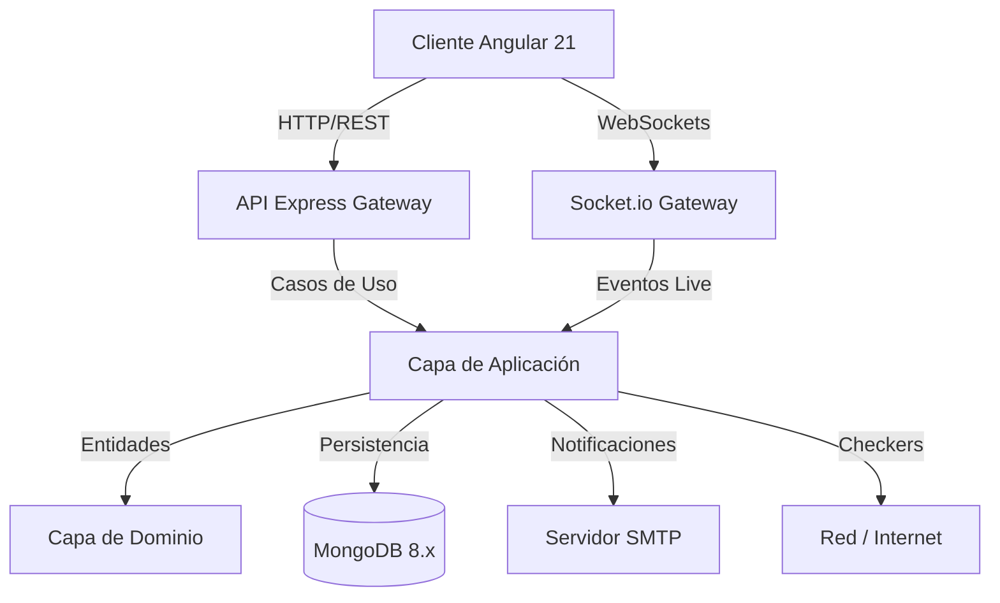
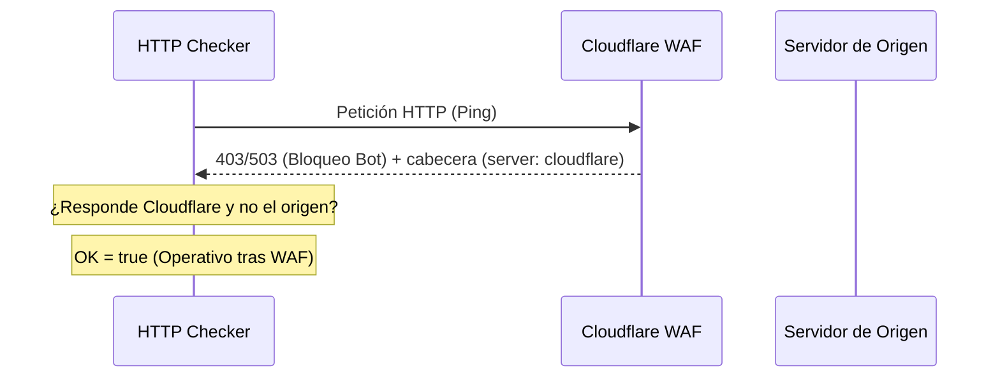

# Documentación Técnica de Azkin

Este documento detalla la arquitectura, el diseño del sistema y el funcionamiento de los componentes clave de **Azkin**.

---

## 🏛️ Arquitectura General

Azkin está diseñado bajo los principios de **Clean Architecture** en el backend y **Arquitectura Reactiva Declarativa (Signals)** en el frontend.



---

## 1. Backend: Clean Architecture & DDD

El backend está estructurado en capas desacopladas para facilitar la testabilidad y el mantenimiento:

### Capa de Dominio (`src/domain`)
* Contiene el núcleo del negocio libre de dependencias externas (sin frameworks ni ORMs).
* **Entidades:** `User`, `Monitor`, `Heartbeat`.
* **Value Objects:** `MonitorStatus` (UP, DOWN, PENDING) y `MonitorType` (http, ping, port, dns, push, snmp).
* **Errores de Dominio:** Base común para manejar excepciones de negocio con traducción HTTP directa.

### Capa de Aplicación (`src/application`)
* Orquesta el flujo de datos desde y hacia el dominio.
* **Casos de Uso:** Registro, Login, CRUD de Monitores, obtención de estadísticas e históricos.
* **Motor de Ejecución (`ExecuteCheck`):** Evalúa el estado de red de cada monitor. Posee una lógica de reintentos configurables e intervalo de reintento antes de declarar un estado `DOWN` definitivo.
* **Puertos:** Interfaces de los repositorios y servicios externos (SMTP, sockets).

### Capa de Infraestructura (`src/infrastructure`)
* Implementa las interfaces de la capa de aplicación con tecnologías específicas:
  * **Persistencia:** Mongoose con MongoDB 8. Colección `Heartbeat` optimizada como *Time Series Collection* con TTL automático de 30 días para evitar el crecimiento desmedido de la base de datos de latencias.
  * **Checkers:** Estrategias específicas de ping, sockets TCP, DNS, SNMP y peticiones HTTP.
  * **Concurrencia (`p-limit`):** Controla que las verificaciones simultáneas no saturen el host de red.
  * **Scheduler:** Programador recursivo en memoria (`setTimeout`) que encola las tareas a intervalos regulares sin dependencias de sistemas externos de colas.

---

## 2. Detección y Bypass de Cloudflare WAF

Las comprobaciones a servicios detrás de Cloudflare WAF suelen ser rechazadas con respuestas `403 Forbidden` o `503 Service Unavailable` si provienen de bots. Azkin posee una regla heurística para evitar falsas alarmas:



1. **Captura de Cabeceras:** Se analizan las cabeceras de respuesta del servidor buscando `server: cloudflare`, `cf-ray` o `cf-cache-status`.
2. **Evaluación de Estado:** Si se recibe un código de error de cliente/servidor (`403` o `503`) pero proviene de la red perimetral de Cloudflare, se infiere que el proxy perimetral está en línea (lo que descarta caídas del servidor de origen).
3. **Respuesta:** El estado del monitor se marca como **UP (Operativo)** bajo el mensaje especial `Operativo (CF WAF - [status])`.

---

## 3. Frontend: Estado Reactivo Angular 21

La SPA del frontend está estructurada de forma moderna sin módulos clásicos (Standalone Components) y maneja el estado de forma síncrona/reactiva mediante **Signals**:

### Arquitectura de Componentes
* **Dashboard (`/dashboard`):** Vista consolidada. Consume un listado reactivo de monitores que se auto-actualiza vía WebSockets cuando ocurren cambios en el backend.
* **Settings (`/settings`):** Panel de administración unificado estructurado en sub-pestañas mediante un selector de estado síncrono. Permite configurar SMTP, Viewers y Respaldos JSON.

### Visualización y Gráficas (ECharts)
* **Combined Latency Chart:** Compara las latencias en tiempo real de todos los elementos pertenecientes a un mismo grupo jerárquico.
* **Uptime Blocks:** Heatmap visual del historial de los últimos 30 chequeos de un monitor específico.

---

## 4. Modo Nyan Cat (Easter Egg)

El modo Nyan Cat se renderiza directamente sobre las curvas de latencia de ECharts:

1. **Ubicación Dinámica:** En lugar de poblar la gráfica con múltiples gatos, el sistema inyecta un objeto de punto de datos personalizado **únicamente en la coordenada final (más actual)** de la serie temporal:
   ```ts
   // Solo el último punto del array de latencias contiene el símbolo personalizado
   if (index === data.length - 1) {
     return { value: val, symbol: nyanCatGif, symbolSize: [85, 52] };
   }
   ```
2. **Dibujado:** Los demás puntos se configuran con `symbol: 'none'`. Como resultado, a medida que el gráfico de latencia avanza con nuevos pings en tiempo real, el Nyan Cat "vuela" y escala su altura según los milisegundos reales.
3. **Efecto Reactivo:** Un Angular `effect()` observa los cambios de configuración. Al activar el modo, la instancia de ECharts se redibuja inmediatamente sin recargar la página.

---

## 5. Autenticación MongoDB 8.x

MongoDB 8.x se ejecuta en contenedores Docker Compose con el control de acceso activado:

1. **Inicialización:** La primera vez que el volumen se levanta, se crean los usuarios raíz basados en `AZKIN_MONGO_USER` y `AZKIN_MONGO_PASSWORD` inyectados desde el entorno.
2. **URI de Conexión:** El backend se autentica contra la base de datos `azkin` utilizando la base de autenticación `admin` mediante el parámetro de consulta `?authSource=admin`.
