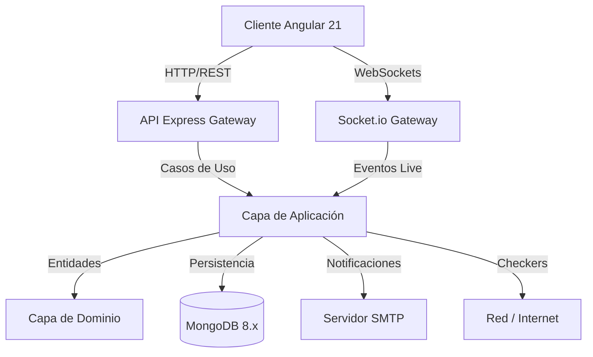
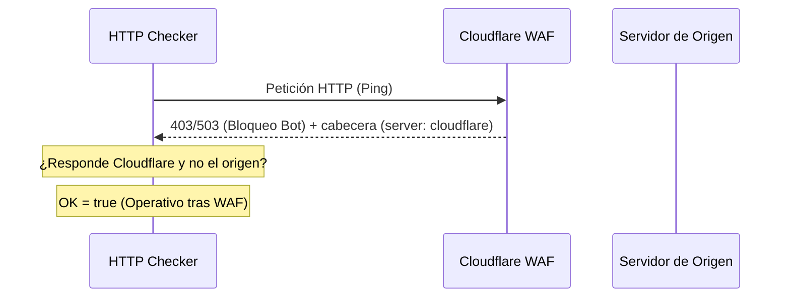
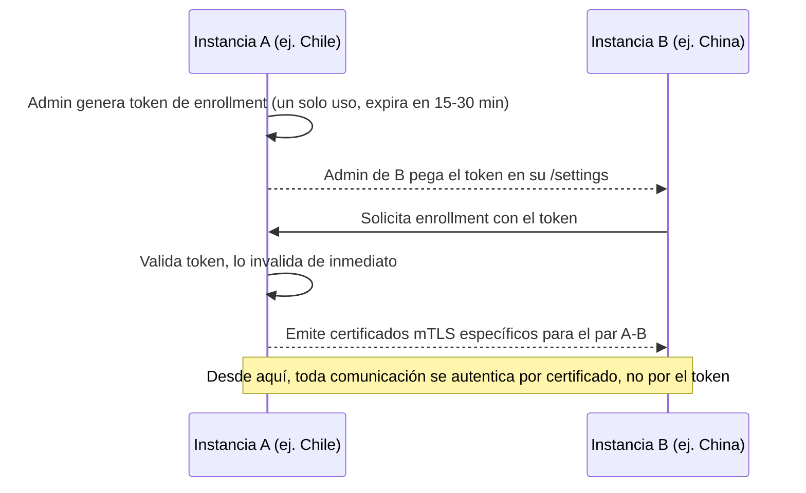
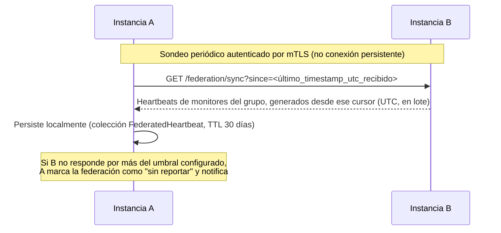

# Documentación Técnica de Azkin

Este documento detalla la arquitectura, el diseño del sistema y el funcionamiento de los componentes clave de **Azkin**.

---

## 🏛️ Arquitectura General

Azkin está diseñado bajo los principios de **Clean Architecture** en el backend y **Arquitectura Reactiva Declarativa (Signals)** en el frontend.



---

## 1. Backend: Clean Architecture & DDD

El backend está estructurado en capas desacopladas para facilitar la testabilidad y el mantenimiento:

### Capa de Dominio (`src/domain`)
* Contiene el núcleo del negocio libre de dependencias externas (sin frameworks ni ORMs).
* **Entidades:** `User`, `Monitor`, `Heartbeat`.
* **Value Objects:** `MonitorStatus` (UP, DOWN, PENDING, MAINTENANCE, DEGRADED — ver §12 y §13) y `MonitorType` (http, ping, port, dns, push, snmp).
* **Errores de Dominio:** Base común para manejar excepciones de negocio con traducción HTTP directa.

### Capa de Aplicación (`src/application`)
* Orquesta el flujo de datos desde y hacia el dominio.
* **Casos de Uso:** Registro, Login, CRUD de Monitores, obtención de estadísticas e históricos.
* **Motor de Ejecución (`ExecuteCheck`):** Evalúa el estado de red de cada monitor. Posee una lógica de reintentos configurables e intervalo de reintento antes de declarar un estado `DOWN` definitivo.
* **Puertos:** Interfaces de los repositorios y servicios externos (SMTP, sockets).

### Capa de Infraestructura (`src/infrastructure`)
* Implementa las interfaces de la capa de aplicación con tecnologías específicas:
  * **Persistencia:** Mongoose con MongoDB 8. Colección `Heartbeat` optimizada como *Time Series Collection* con TTL automático de 30 días para evitar el crecimiento desmedido de la base de datos de latencias.
  * **Checkers:** Estrategias específicas de ping, sockets TCP, DNS, SNMP y peticiones HTTP.
  * **Concurrencia (`p-limit`):** Controla que las verificaciones simultáneas no saturen el host de red.
  * **Scheduler:** Programador recursivo en memoria (`setTimeout`) que encola las tareas a intervalos regulares sin dependencias de sistemas externos de colas.

---

## 2. Detección y Bypass de Cloudflare WAF

Las comprobaciones a servicios detrás de Cloudflare WAF suelen ser rechazadas con respuestas `403 Forbidden` o `503 Service Unavailable` si provienen de bots. Azkin posee una regla heurística para evitar falsas alarmas:



1. **Captura de Cabeceras:** Se analizan las cabeceras de respuesta del servidor buscando `server: cloudflare`, `cf-ray` o `cf-cache-status`.
2. **Evaluación de Estado:** Si se recibe un código de error de cliente/servidor (`403` o `503`) pero proviene de la red perimetral de Cloudflare, se infiere que el proxy perimetral está en línea (lo que descarta caídas del servidor de origen).
3. **Respuesta:** El estado del monitor se marca como **UP (Operativo)** bajo el mensaje especial `Operativo (CF WAF - [status])`.

---

## 3. Frontend: Estado Reactivo Angular 21

La SPA del frontend está estructurada de forma moderna sin módulos clásicos (Standalone Components) y maneja el estado de forma síncrona/reactiva mediante **Signals**:

### Arquitectura de Componentes
* **Dashboard (`/dashboard`):** Vista consolidada. Consume un listado reactivo de monitores que se auto-actualiza vía WebSockets cuando ocurren cambios en el backend.
* **Settings (`/settings`):** Panel de administración unificado estructurado en sub-pestañas mediante un selector de estado síncrono. Permite configurar SMTP, Viewers y Respaldos JSON.

### Visualización y Gráficas (ECharts)
* **Combined Latency Chart:** Compara las latencias en tiempo real de todos los elementos pertenecientes a un mismo grupo jerárquico.
* **Uptime Blocks:** Heatmap visual del historial de los últimos 30 chequeos de un monitor específico.

### Descomposición de `dashboard.ts` y `settings.ts` (AZ-016)

Ambos eran originalmente componentes "Dios" (`dashboard.ts` ~2300 líneas, `settings.ts` ~1180
líneas) mezclando varios dominios funcionales no relacionados en una sola clase. Se descompusieron
por fases en subcomponentes presentacionales, manteniendo el componente original como orquestador
delgado:

**`SettingsComponent` (171 líneas, orquestador de pestaña activa + restauración de `?tab=`)**
delega cada dominio a un subcomponente propio:

| Subcomponente | Pestaña / dominio |
|---|---|
| `TlsPanelComponent` | Certificados TLS (texto o archivo), puerto HTTPS, SMTP de Aplicación y Motor de Monitoreo (umbrales DEGRADADO/polling adaptativo) |
| `AuditLogPanelComponent` | Consulta del historial de auditoría (`GET /api/v1/audit-log`), incluyendo el diff de campos modificados |
| `ApiKeysPanelComponent` | Generación, listado, revocación y borrado permanente de API Keys |
| `BackupsPanelComponent` | Respaldos JSON, restauración, purga de instancia e importación masiva de monitores vía CSV |
| `ViewersPanelComponent` | Gestión de cuentas Viewer y de otras cuentas Admin |
| `AlertsPanelComponent` | Canales de notificación y plantillas por evento |
| `MaintenancePanelComponent` | Ventanas de mantenimiento (silenciado de alertas), ver §12 |

**`DashboardComponent` (1580 líneas, bajó desde 2291)** extrajo:

* `QuickStatsPanelComponent` — KPIs e incidentes recientes.
* `DashboardNavbarComponent` — logo, selector de tema/idioma, Nyan Cat, logout.
* `MonitorFormComponent` — slide-over de alta/edición de monitor (las 6 variantes de tipo).

**Remanente sin extraer, documentado en [ISSUES.md](../ISSUES.md) (AZ-016):** los gráficos ECharts
(`initChart`/`updateChart`/`initGroupChart`/`updateGroupChart`), el panel de detalle de
monitor/grupo que los aloja y el árbol de monitores del sidebar siguen dentro de
`DashboardComponent` — comparten estado en vivo (`selectedMonitor`/`selectedGroup`/
`historyPoints`/`groupHistoryMap`) con el handler de heartbeats de Socket.io y el efecto Nyan Cat
embebido en las opciones de ECharts, por lo que su extracción se dejó para una sesión con QA visual
en navegador.

### Componentes y servicios compartidos nuevos

Introducidos durante la descomposición de AZ-016, viven en `shared/components` y `core/services`
para reutilizarse fuera de Settings/Dashboard:

* **`ConfirmService` + `ConfirmModalComponent`** — reemplaza los `confirm()` nativos del navegador
  por un modal de confirmación programático (`confirmService.ask(...)` devuelve una `Promise<boolean>`).
* **`ToastService` + `ToastComponent`** — notificaciones no bloqueantes (éxito/error/info) para
  reemplazar los `alert()` nativos restantes.
* **`ChangePasswordModalComponent`** — flujo de cambio de contraseña unificado, reutilizado tanto
  desde `/profile` como desde la gestión de otras cuentas Admin/Viewer en `/settings`.
* **`EmojiPickerComponent`** — selector de emojis reutilizado en el editor de plantillas de
  notificación (`AlertsPanelComponent`).

---

## 4. Modo Nyan Cat (Easter Egg)

El modo Nyan Cat se renderiza directamente sobre las curvas de latencia de ECharts:

1. **Ubicación Dinámica:** En lugar de poblar la gráfica con múltiples gatos, el sistema inyecta un objeto de punto de datos personalizado **únicamente en la coordenada final (más actual)** de la serie temporal:
   ```ts
   // Solo el último punto del array de latencias contiene el símbolo personalizado
   if (index === data.length - 1) {
     return { value: val, symbol: nyanCatGif, symbolSize: [85, 52] };
   }
   ```
2. **Dibujado:** Los demás puntos se configuran con `symbol: 'none'`. Como resultado, a medida que el gráfico de latencia avanza con nuevos pings en tiempo real, el Nyan Cat "vuela" y escala su altura según los milisegundos reales.
3. **Efecto Reactivo:** Un Angular `effect()` observa los cambios de configuración. Al activar el modo, la instancia de ECharts se redibuja inmediatamente sin recargar la página.

---

## 5. Autenticación MongoDB 8.x

MongoDB 8.x se ejecuta en contenedores Docker Compose con el control de acceso activado:

1. **Inicialización:** La primera vez que el volumen se levanta, se crean los usuarios raíz basados en `AZKIN_MONGO_USER` y `AZKIN_MONGO_PASSWORD` inyectados desde el entorno.
2. **URI de Conexión:** El backend se autentica contra la base de datos `azkin` utilizando la base de autenticación `admin` mediante el parámetro de consulta `?authSource=admin`.

---

## 6. Autenticación de sesión: access token en memoria + refresh cookie

Azkin usa un modelo híbrido JWT + cookie `HttpOnly`, no bearer-token puro ni cookies puras:

```mermaid
sequenceDiagram
    participant SPA as Angular SPA
    participant API as Backend Express
    participant DB as MongoDB

    SPA->>API: POST /auth/login (credenciales)
    API->>DB: Verifica hash de contraseña
    API-->>SPA: 200 { token, user } + Set-Cookie: refreshToken (HttpOnly, 7d/1a)
    Note over SPA: access token se guarda solo en memoria (nunca localStorage)
    SPA->>API: Requests subsiguientes con Authorization: Bearer <token>
    Note over SPA,API: Al recargar la página, o si el access token expira (401)...
    SPA->>API: POST /auth/refresh (sin body; el navegador envía la cookie)
    API->>API: Verifica y rota el refresh token
    API-->>SPA: 200 { token, user } + Set-Cookie: refreshToken (rotado)
    SPA->>API: POST /auth/logout
    API-->>SPA: 200 + Set-Cookie: refreshToken="" (expirada)
```

* **Access token:** JWT de vida corta (`AZKIN_JWT_EXPIRES_IN`, default 2 h; 1 año para sesiones `isTvSessionEnabled`), viaja en el header `Authorization: Bearer` y vive **solo en memoria** en el cliente (`AuthService`), nunca en `localStorage`/`sessionStorage` — mitiga el robo de sesión vía XSS.
* **Refresh token:** JWT de vida larga (7 días, 1 año en sesiones TV), persistido como cookie `refreshToken` (`HttpOnly`, `SameSite=Lax`, `path=/api/v1/auth`), inaccesible a JavaScript. Se rota en cada uso de `POST /auth/refresh`.
* **Rehidratación tras recargar la página:** como el access token no sobrevive un refresh completo del navegador (vive en memoria), el `authGuard` del frontend llama automáticamente a `POST /auth/refresh` si no encuentra sesión activa; si la cookie es válida, la sesión se restaura sin pedir credenciales de nuevo.
* **Cuentas bloqueadas:** `login` y `refresh` verifican `user.isBlocked` y responden `403 ACCOUNT_BLOCKED`, cerrando la sesión de un Admin bloqueado por otro Admin de forma inmediata en su próximo refresh.
* **Sin revocación server-side de JWT ya emitidos:** al ser stateless, un access token filtrado sigue siendo válido hasta su propio `exp` (ventana corta, 2 h). `logout` solo limpia la cookie de refresh — evita que la sesión se *renueve*, no invalida el access token ya emitido.

## 7. API pública (API Keys)

Para integrar sistemas externos sin usar una sesión de usuario, Azkin expone un prefijo de rutas
alternativo autenticado por API Key:

* **Prefijo:** `/api/public/v1/monitors`, montado sobre el **mismo** `MonitorController`/`monitorRoutes`
  que usa la sesión normal — cero duplicación de lógica de negocio, solo cambia el middleware de
  autenticación (`apiKeyAuth` en vez de `authGuard`).
* **Autenticación:** header `X-API-Key`. La key se hashea con SHA-256 antes de comparar/persistir —
  nunca se guarda en claro. El valor completo solo se muestra una vez, al crearla.
* **Scopes:** `read` (habilita `GET`) y `write` (habilita `POST`/`PUT`/`PATCH`/`DELETE`), verificados
  por método HTTP en el middleware.
* **Gestión de keys:** `POST/GET /api/v1/api-keys`, `DELETE /api/v1/api-keys/:id` (requieren sesión de
  Admin), UI en `/settings` → pestaña **API**.

Ver [`docs/api-publica.md`](./api-publica.md) para el contrato completo y ejemplos `curl`.

## 8. Gestión multi-administrador y auditoría

Consistente con el diseño "sin aislamiento por tenant" (todos los Admins comparten el mismo pool
global de monitores/canales/respaldos, ver §3 del modelo de datos): cualquier Admin autenticado
puede administrar las cuentas de **otros** Admins (editar email, resetear contraseña, bloquear,
eliminar), con protección explícita contra auto-bloqueo/auto-eliminación accidental en el propio
caso de uso (`actorId === targetId` → `ForbiddenError`).

Un amplio inventario de acciones administrativas (~39 tipos, ver tabla abajo) se registra en una
colección de auditoría (`IAuditLogRepository`) y es consultable desde `/settings` → pestaña
**Auditoría** o `GET /api/v1/audit-log`. No existe una lista central de tipos de acción (son
strings sueltos, convención `RECURSO_VERBO`): cada caso de uso que necesita auditar algo recibe
`IAuditLogRepository` por constructor y llama `.record({ actorId, action, targetType, targetIds?,
metadata? })` justo antes de retornar.

| Área | Acciones auditadas |
|---|---|
| Autenticación | `LOGIN_SUCCESS`, `LOGIN_FAILED` (contraseña incorrecta o identificador inexistente), `LOGIN_BLOCKED` |
| Monitores | `MONITOR_CREATE`/`UPDATE`/`DELETE`, `MONITORS_BULK_DELETE`, `MONITORS_BULK_ASSIGN_NOTIFICATION`, `MONITORS_CSV_IMPORT`, `MONITORS_ASSETS_IMPORT` |
| Notificaciones | `NOTIFICATION_CREATE`/`UPDATE`/`DELETE` |
| Viewers/Admins | `VIEWER_CREATE`/`DELETE`, `VIEWER_PERMISSIONS_UPDATE`, `VIEWER_PASSWORD_RESET`, `ADMIN_CREATE`/`UPDATE`/`DELETE`, `ADMIN_BLOCKED_SET`, `ADMIN_PASSWORD_RESET`, `PASSWORD_RESET_REQUESTED`/`COMPLETED` |
| API Keys | `API_KEY_CREATE`, `API_KEY_REVOKE`, `API_KEY_DELETE` |
| Mantenimiento | `MAINTENANCE_CREATE`/`UPDATE`/`END`/`DELETE` |
| Respaldos | `BACKUP_CREATE`, `BACKUP_REPLACE`, `BACKUP_DELETE`, `BACKUP_DOWNLOAD`, `BACKUP_IMPORT` (la purga de instancia queda deliberadamente sin auditar: borra todo el historial de auditoría, así que registrarla ahí sería contradictorio) |
| Sistema | `TLS_CONFIG_UPDATE`, `APP_SMTP_CHANNEL_SET`, `MONITORING_ENGINE_SETTINGS_SET` |

Para las ediciones (monitor, notificación, permisos de viewer, email de admin, ventana de
mantenimiento), `metadata.changes` guarda el diff exacto de qué campos cambiaron (`{ from, to }`
por campo), calculado con el helper puro `diffFields()` (`application/services/diff-fields.ts`) —
no solo "se editó". En notificaciones, los valores sensibles del `config`
(`webhookUrl`/`botToken`/`smtpPassword`) se enmascaran antes de guardarse en el diff (reutilizando
`maskSecret()`), para que un secreto rotado nunca quede en texto plano en el historial.

`ListAuditLogUseCase` resuelve el email del actor por `IUserRepository.findById` (cubre tanto
Admin como Viewer — un login de Viewer también se audita). Si `actorId` es `null` (un
`LOGIN_FAILED` con un identificador que no corresponde a ningún usuario existente — el único caso
donde `actorId` puede ser nulo en `IAuditLog`), se usa `metadata.attemptedIdentifier` en su lugar.

## 9. Notificaciones: plantillas, enmascarado de secretos y prueba SMTP

* **Plantillas por evento** (`DOWN`, `RECOVERED`, `LATENCY_HIGH`, `DEFACEMENT`) con variables
  `{{monitor}}`, `{{url}}`, `{{status}}`, etc., insertables con un clic desde un cheatsheet, más un
  selector de emojis — ambos widgets insertan en la posición del cursor del campo enfocado.
* **Enmascarado de secretos:** los campos `webhookUrl`/`botToken`/`smtpPassword` del `config` de un
  canal nunca viajan en texto plano en las respuestas de la API — se devuelven enmascarados
  (`••••` + últimos 4 caracteres). El formulario de edición reconoce ese formato: si el campo no fue
  modificado, el backend conserva el secreto real en vez de sobrescribirlo con el placeholder.
* **SMTP de aplicación** (usado solo para recuperación de contraseña, independiente del SMTP por
  canal de notificación) expone su estado (configurado/no, host, puerto — nunca la contraseña) y
  permite enviar un correo de prueba real desde `/settings`, sin esperar a que un usuario lo necesite.

## 10. Modo TV / Kiosko

Las cuentas Viewer con `isTvSessionEnabled` están pensadas para pantallas de sala de monitoreo sin
interacción humana frecuente: reciben un access token y refresh token de 1 año (evita
re-autenticaciones constantes) y el frontend activa una clase `body.kiosk-mode` con fuentes y
espaciados ampliados para lectura a distancia en TVs 4K, ocultando controles no esenciales (ej. la
barra de búsqueda) que no aplican a una pantalla de solo lectura.

## 11. Fallback automático para monitorear el mismo servidor (`host.docker.internal`)

Igual que el bypass de Cloudflare WAF (§2), este es otro caso donde un checker no toma un fallo de
red al pie de la letra sin antes descartar una causa conocida y benigna: un monitor cuyo target es
un servicio en el **mismo servidor físico** que Azkin (otro contenedor suelto, otro `docker
compose`, o un proceso nativo) puede fallar por IP LAN no alcanzable desde dentro del contenedor
`azkin-back` — un límite de red de Docker/el firewall del host, no una caída real del servicio.

* **Detección:** los checkers `HttpChecker`, `PortChecker` y `PingChecker`
  (`infrastructure/checkers/same-host-fallback.ts`, función `shouldAttemptHostGatewayFallback`)
  activan el fallback si el fallo es de **conexión** (`ECONNREFUSED`/`ETIMEDOUT`/`ENETUNREACH`/
  `EHOSTUNREACH` — para HTTP, extraído de `error.cause.code`) *y* además se cumple una de dos
  condiciones: el target es una **IP privada** (RFC 1918: `10.0.0.0/8`, `172.16.0.0/12`,
  `192.168.0.0/16`, más loopback), detectado automáticamente; o el monitor tiene marcado
  `sameHostAsAzkin: true`, declarado explícitamente por quien lo configuró (checkbox "Este
  objetivo vive en el mismo servidor que Azkin" en el formulario, solo visible para tipo
  http/ping/port) — cubre un dominio/hostname que resuelve al propio servidor, caso que
  `isPrivateIpv4` no puede inferir por sí sola. Nunca se activa ante un dominio público sin ese
  flag, ni ante una respuesta HTTP real (un 4xx/5xx genuino del servidor jamás dispara el
  fallback).
* **Fallback:** reintenta una sola vez, con timeout corto (5s), contra el mismo puerto/ruta pero
  usando `host.docker.internal` — hostname que Docker resuelve a la IP del host físico gracias a
  `extra_hosts: host.docker.internal:host-gateway` en `compose.yaml`/`compose.dev.yaml` (Docker
  Engine ≥ 20.10). Quien configura el monitor no necesita saber nada de esto: sigue usando la
  IP/dominio real del servicio.
* **Transparencia:** si el fallback fue necesario, el mensaje de estado del monitor lo dice
  explícitamente (ej. `200 OK (vía host.docker.internal: ... no alcanzable directamente desde el
  contenedor)`), para que sea auditable por qué un monitor está "arriba" sin depender del target
  configurado tal cual.

Ver [`docs/instalacion-docker.md`](./instalacion-docker.md) §10 para el detalle operativo y qué
hacer si el fallback tampoco alcanza el servicio (firewall del host más restrictivo).

## 12. Módulo de Mantenimiento (silenciado de alertas)

Nueva entidad `IMaintenanceWindow` (`domain/entities/maintenance-window.ts`) + puerto
`IMaintenanceRepository` + `MongooseMaintenanceRepository`, siguiendo el mismo patrón Clean
Architecture que notificaciones/respaldos. El alcance (`IMaintenanceScope`) reutiliza el mismo
shape `{ type: "all"|"group"|"monitor", value? }` que ya usan los permisos de Viewer
(`maintenance-scope-policy.ts` es el equivalente de `monitor-access-policy.ts`).

* **Silenciado real**, en `ExecuteCheckUseCase`: antes de ejecutar el checker, resuelve si hay una
  ventana activa para el monitor; si la hay, **no ejecuta el checker real**, guarda un heartbeat
  con `status: MonitorStatus.MAINTENANCE` (valor del enum que existía desde antes sin ningún
  productor) y no llama al notificador — el silenciado es implícito porque MAINTENANCE nunca entra
  al bloque de transición UP/DOWN que dispara alertas. `lastStatus`/`retryAttempts` se preservan
  intactos para que la siguiente transición real (al terminar el mantenimiento) se compare contra
  el último UP/DOWN confirmado, no contra MAINTENANCE.
* **Uptime 24h:** los heartbeats en MAINTENANCE quedan excluidos del `$match` de la agregación de
  `getSummaries()` — no cuentan ni en el numerador ni en el denominador (a diferencia de DEGRADADO,
  ver §13, que sí suma como crédito parcial).
* **Prioridad de grupo** (`combineStatus`): `DOWN > DEGRADED > PENDING > MAINTENANCE > UP`.
* **"¿Está vigente ahora mismo?"** se resuelve al vuelo, sin cron/timer nuevo: `closedAt === null
  && (mode === "immediate" || (startAt <= now && now <= endAt))`.
* **API** bajo `requireRole("admin")`: `POST/GET/PUT /api/v1/maintenance`,
  `POST /api/v1/maintenance/:id/end`, `DELETE /api/v1/maintenance/:id`.
* **UI:** `MaintenancePanelComponent` en `/settings` → pestaña **Mantenimiento**, mismo selector de
  alcance granular que ya usa el formulario de permisos de Viewer, y badge color **sky/azul**
  distinto de UP/DOWN/PENDING/DEGRADADO en todo el dashboard.

## 13. Estado DEGRADADO y monitoreo adaptativo

Complementa el silenciado de §12: un sitio que no está muerto, sino "pegado" (responde pero tarda,
o el host sigue vivo a nivel de red mientras la app dejó de responder) se distingue de una caída
total en vez de marcarse DOWN puro. Exclusivo a monitores `type: "http"`, con dos caminos de
entrada independientes en `ExecuteCheckUseCase`:

1. **Latencia alta directa:** un HTTP que responde OK pero por sobre `AZKIN_DEGRADED_LATENCY_MS`
   (default `5000`) pasa a `MonitorStatus.DEGRADED` de inmediato, sin esperar timeout ni pasar por
   reintentos. El `msg` del heartbeat indica la latencia real y el umbral, no el `"200 OK"`
   genérico del checker.
2. **Heurística post-caída** (fire-and-forget, no bloquea el aviso DOWN): tras confirmar DOWN,
   `runDegradationHeuristic()` prueba ping/TCP contra el mismo host, reutilizando
   `PingChecker`/`PortChecker` ya registrados en `composition-root.ts` (sin nueva inyección de
   dependencias, respetando sus timeouts y el `pLimit` global). Si cualquiera responde, guarda un
   segundo heartbeat DEGRADED con el ping real medido en esa capa (nunca el `ping: null` del
   heartbeat DOWN original) y notifica un segundo aviso. Si ambos fallan, el DOWN ya emitido queda
   como veredicto final.

**Polling adaptativo:** mientras un monitor está DOWN o DEGRADADO (por cualquiera de los dos
caminos), su intervalo de chequeo baja a `AZKIN_ACCELERATED_INTERVAL_SECONDS` (default `15`) —
nunca más rápido que el `retryInterval` propio del monitor
(`Math.max(acceleratedIntervalSeconds, monitor.retryInterval)`, para no violar un límite de
reintento explícitamente configurado más lento). Vuelve al intervalo normal apenas responde UP. Las
alertas siguen gateadas por transición real (`lastStatus !== status`), nunca por cada chequeo — un
monitor que permanece DOWN/DEGRADADO en chequeos consecutivos no repite el aviso pese al polling
más frecuente.

**Uptime 24h:** un heartbeat DEGRADADO suma **crédito parcial (0.5)** en `getSummaries()` — a
diferencia de MAINTENANCE (§12), que se excluye del todo. Badge color **naranja** en todo el
frontend (dashboard, quick-stats, heatmap).

**Configuración editable desde la UI:** ambos umbrales no viven solo en `.env` — nueva entidad
singleton `MonitoringEngineSettings` (mismo patrón que `AppSmtpSettings`/`TlsConfig`) con
`ResolveMonitoringEngineConfig` (caché en memoria de 30s para no golpear Mongo en cada chequeo)
resolviendo un override guardado en Mongo por encima del valor de `.env`. UI en `/settings` →
**TLS/Sistema** → "Motor de Monitoreo", con botón "Restablecer" por campo que vuelve al valor de
`.env` sin reiniciar el contenedor.

## 14. Federación de instancias (multi-región)

> 🚧 **Planeado, no implementado.** Esta sección documenta una decisión de arquitectura ya
> tomada y su diseño, para que quede registrada antes de construirla — no describe código
> existente. Ningún archivo, entidad o endpoint mencionado aquí existe todavía en el repo.
> Especificación completa (comportamiento esperado, criterios de aceptación, pistas de
> investigación) en [`ISSUES.md`](../ISSUES.md), **AZ-049**.

**Por qué existe esta decisión:** Azkin corre hoy como una única instancia con una única ubicación
geográfica de origen para sus checks activos. Eso impide distinguir "el sitio está realmente
caído" de "hay un problema de red regional entre el datacenter de Azkin y el sitio monitoreado"
(ej. un corte de peering entre Chile y Asia que no afecta al resto del mundo). La solución elegida
—correr una instancia Azkin completa por región y **federarlas**— se evaluó contra dos alternativas
descartadas explícitamente:

* **"Central único + nodos sonda livianos"**: un solo Azkin con la base de datos y el dashboard,
  y nodos remotos sin estado propio que solo ejecutan checks y reportan. Se descartó porque si el
  central cae, todo el sistema (dashboard, alertas, historial) cae con él — justo lo que se quería
  evitar.
* **"Malla P2P sin autoridad única"** (descubrimiento tipo gossip, consenso/quorum, datos
  replicados sin dueño): resuelve mejor la independencia, pero implica un rediseño distribuido
  completo, comparable a construir un sistema nuevo desde cero — sobredimensionado para el caso de
  uso real (comparar el mismo sitio desde un puñado de regiones).

**Modelo elegido — federación de instancias completas e independientes:** cada región corre un
Azkin normal y autosuficiente (su propia base de datos, dashboard, monitores y alertas). Dos
instancias se **enrolan** entre sí (mTLS, con un token de enrollment de un solo uso — mismo
concepto que el enrollment token de Elasticsearch/Kibana) y a partir de ahí intercambian
resultados de monitores que el Admin agrupó explícitamente como "el mismo objetivo". Si una
instancia cae, las demás no pierden ninguna funcionalidad propia; solo dejan de recibir datos
frescos de esa instancia para la vista combinada.





**Límites deliberados de esta decisión (no técnicos, de alcance):**

* **Máximo 5 instancias federadas simultáneas.** El modelo de malla completa (cada par se enrola
  directamente) es simple y suficiente para ese tamaño; no se diseña para 10+ instancias, relay/hub
  ni invitación en bloque — eso sería sobreingeniería para el caso de uso real.
* **Alertas siempre independientes por instancia**: cada Azkin notifica según lo que ve
  localmente, sin esperar confirmación de sus pares.
* **La vista "Combinado" nunca reemplaza la vista por-región**, y reutiliza la misma jerarquía de
  severidad que ya usa `combineStatus()` en `get-group-overview.usecase.ts`
  (`DOWN > DEGRADED > PENDING > MAINTENANCE > UP`) en vez de inventar una regla nueva.
