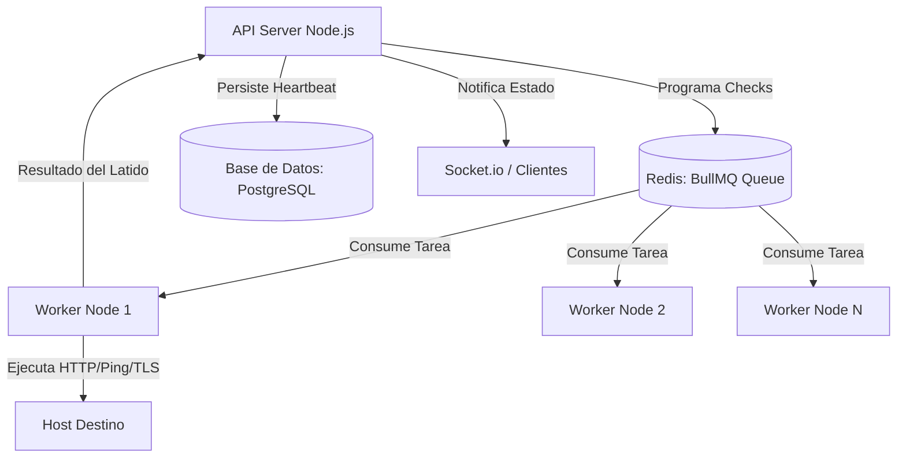

# Propuesta de Arquitectura y Rediseño de Ingeniería del Clon Mejorado

Este documento propone un rediseño de arquitectura empresarial para un clon mejorado de Uptime Kuma, abordando las limitaciones de escalabilidad, acoplamiento y concurrencia identificadas en el proceso de ingeniería inversa.

---

## 1. Diseño Arquitectónico Propuesto: Clean Architecture

Para solucionar el acoplamiento detectado (donde el modelo `Monitor.js` centraliza consultas SQL, sockets y lógica de red), se propone estructurar el backend siguiendo los patrones de **Clean Architecture** (Arquitectura Cebolla):

```
       ┌────────────────────────────────────────────────────────┐
       │                 CAPA DE INFRAESTRUCTURA                │
       │  [Prisma ORM] [Socket.io Gateway] [Axios/Playwright]   │
       │  [BullMQ Workers] [Express Controllers]                │
       └──────────────────────────┬─────────────────────────────┘
                                  │
       ┌──────────────────────────▼─────────────────────────────┐
       │                   CAPA DE APLICACIÓN                   │
       │  [CreateMonitorUseCase] [ExecuteCheckUseCase]           │
       │  [SendAlertUseCase]                                    │
       └──────────────────────────┬─────────────────────────────┘
                                  │
       ┌──────────────────────────▼─────────────────────────────┐
       │                    CAPA DE DOMINIO                     │
       │  [MonitorEntity] [HeartbeatEntity] [AlertInterface]    │
       └────────────────────────────────────────────────────────┘
```

* **Domain (Dominio)**: Entidades puras y reglas de negocio libres de librerías externas. La entidad `Monitor` solo define atributos y validaciones básicas.
* **Application (Aplicación - Casos de Uso)**: Define las acciones del sistema. Por ejemplo, `ExecuteCheckUseCase` coordina la llamada a un cliente de red y persiste el resultado a través de una interfaz de repositorio.
* **Infrastructure (Infraestructura)**: Implementaciones concretas de base de datos (Prisma ORM), envío de red (Axios, Playwright) y controladores REST/Sockets.

---

## 2. Rediseño del Motor de Monitoreo: Distribución de Carga

En lugar de delegar el agendamiento y ejecución al Event Loop principal de Node.js con `setTimeout`, se propone utilizar una **Arquitectura de Colas Distribuidas** con **BullMQ** (basado en Redis) y subprocesos independientes (Workers):



### Ventajas de este Rediseño:
1. **Escalabilidad Horizontal**: Si el número de monitores crece de 100 a 10,000, simplemente se despliegan más contenedores "Worker" para procesar la cola de Redis sin alterar el servidor de base de datos o el de cara al usuario.
2. **Resiliencia ante Bloqueos**: Tareas pesadas como arrancar navegadores Chromium para simular interacciones complejas no bloquean las peticiones HTTP del panel del usuario, ya que corren en procesos de sistema aislados.

---

## 3. Optimización del Motor de Base de Datos y Purga

### 3.1 Reemplazo de ORM y Conectores
* **Propuesta**: Utilizar **Prisma ORM** con una base de datos relacional robusta (como **PostgreSQL**).
* **Motivación**: Proporciona tipado estricto a través de TypeScript, pooling de conexiones optimizado de forma nativa y la generación automática de esquemas de base de datos declarativos, eliminando la inestabilidad de RedBean Node.

### 3.2 Purga de Datos en Lotes (Batch Processing)
Para solventar el problema de E/S causado por borrar registros obsoletos en cada check:
* **Solución**: Desacoplar la purga de datos históricos y programarla como un único **Cron Job en segundo plano** ejecutado cada 24 horas (o cada hora en bases de datos masivas).
* **Código de ejemplo teórico (NestJS / Prisma)**:
```typescript
@Injectable()
export class DatabaseCleanupService {
  constructor(private prisma: PrismaService) {}

  // Se ejecuta automáticamente cada día a las 00:00:00
  @Cron(CronExpression.EVERY_DAY_AT_MIDNIGHT)
  async purgeOldHeartbeats() {
    const limitDate = dayjs().subtract(30, 'day').toDate();
    
    // Executa el borrado en un lote único de bajo impacto
    const result = await this.prisma.heartbeat.deleteMany({
      where: {
        time: { lt: limitDate }
      }
    });
    
    console.log(`[Database Cleanup] Purged ${result.count} old heartbeats.`);
  }
}
```

---

## 4. Desacoplamiento de Navegadores Headless (Playwright)

El método actual instala Chromium en caliente usando comandos `apt` dentro del mismo contenedor del backend y consume recursos locales de RAM/CPU al levantar la interfaz gráfica.

### Solución Propuesta:
* **Separación de Servicios**: Retirar el motor de Chromium del backend e implementar un servicio satélite de tipo **Browserless** (`browserless/chrome` en Docker) en un contenedor dedicado.
* **Integración Remota**: Conectar el cliente de Playwright a través de WebSockets hacia el puerto expuesto del contenedor de Browserless:
```javascript
const browser = await chromium.connectOverCDP("ws://browserless-container:3000");
const context = await browser.newContext();
const page = await context.newPage();
await page.goto(url);
// Ejecución y Captura remota...
```
* **Impacto**: El contenedor del servidor web de Node.js se mantiene ligero y seguro, delegando todo el uso intensivo de procesador e instalación de dependencias gráficas a un servicio especializado aislado en la red interna de Docker.

---

## 5. Arquitectura Híbrida: REST API First + Websockets

Toda interacción de usuario que modifique el estado de la aplicación debe pasar por protocolos de red estándar e interoperables:

* **REST API**:
  * `POST /api/v1/monitors`: Crear monitor.
  * `GET /api/v1/monitors`: Listar monitores.
  * `DELETE /api/v1/monitors/:id`: Eliminar monitor.
* **OpenAPI / Swagger**: Auto-documentar el API del backend permitiendo a desarrolladores e ingenieros de SOC integrar el clon con herramientas como Terraform o flujos automáticos de SIEM/SOAR.
* **WebSockets**:
  * Su rol queda restringido a actuar como un bus de mensajería en vivo (*Pub/Sub*). Cuando el orquestador detecta un latido, publica una trama simplificada por el canal de sockets correspondiente únicamente para actualizar la interfaz del dashboard del cliente, sin interferir en la manipulación lógica de los recursos.
