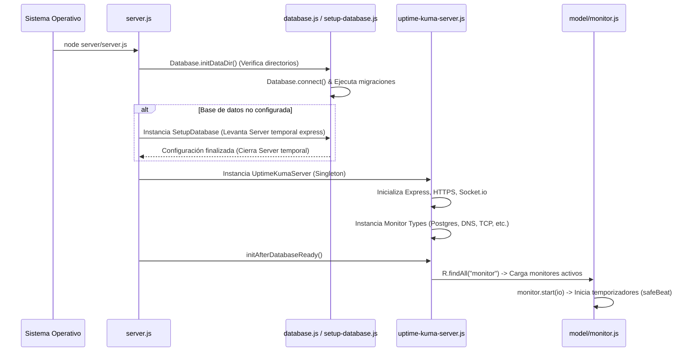

# Reporte de Ingeniería Inversa: Arquitectura y Funcionamiento Interno de Uptime Kuma (v2.4.0)

Este documento detalla el análisis avanzado de ingeniería inversa del proyecto **Uptime Kuma**, analizando la inicialización del servidor, los flujos internos del motor de monitoreo asíncrono, la gestión y agregación estadística de base de datos, el orquestador de navegadores headless y las mitigaciones de seguridad implementadas.

---

## 1. Ciclo de Vida e Inicialización del Servidor

El flujo de arranque del servidor está orquestado principalmente por tres archivos del directorio `server/`:



1. **`server/server.js` (Punto de entrada)**: 
   * Configura las variables de entorno y maneja los flags de consola.
   * Inicializa la carpeta de datos de usuario (`./data/`).
   * Captura señales de terminación del sistema operativo (`SIGINT`, `SIGTERM`) para realizar un apagado ordenado de los procesos de red y cerrar las conexiones a bases de datos.
2. **`server/setup-database.js`**:
   * Si no se detecta la base de datos configurada, se levanta una instancia minimalista de Express en un puerto temporal para permitir al usuario definir si usará SQLite local o un servidor externo (MariaDB). Al confirmarse, escribe `db-config.json` y cierra este servidor temporal.
3. **`server/database.js`**:
   * Ejecuta el cargador de la base de datos.
   * Ejecuta las migraciones pendientes del esquema físico mediante **Knex** e históricos `.sql`.
   * Configura el conector ORM **RedBean Node** asignando el driver correspondiente.
4. **`server/uptime-kuma-server.js`**:
   * Clase Singleton principal (`UptimeKumaServer`) que maneja las instancias de Express y Socket.io.
   * Instancia y mapea en memoria los tipos de monitores en un objeto asociativo (`UptimeKumaServer.monitorTypeList`).
5. **Carga y Activación de Tareas**:
   * Una vez completados los pasos anteriores, el servidor consulta todos los monitores activos de la base de datos y llama al método `start()` de cada instancia.

---

## 2. Motor de Monitoreo: Mecanismo de Temporización Asíncrona

Uptime Kuma evita el uso de `setInterval()` para ejecutar sus checks recurrentes, previniendo cuellos de botella y superposiciones de tareas (un check lento bloqueando el hilo de ejecución principal).

### 2.1 Patrón del Bucle Recursivo `safeBeat`
El monitoreo se implementa en `server/model/monitor.js` mediante un bucle cerrado usando `setTimeout` encadenados recursivamente:

```javascript
// Simplificación lógica del mecanismo en Monitor.js
const beat = async () => {
    let bean = R.dispense("heartbeat");
    bean.monitor_id = this.id;
    bean.time = R.isoDateTimeMillis(dayjs.utc());
    bean.status = DOWN; // Estado por defecto

    try {
        if (await Monitor.isUnderMaintenance(this.id)) {
            bean.status = MAINTENANCE;
        } else if (this.type === "http") {
            // Lógica HTTP
            let res = await this.makeAxiosRequest(options);
            bean.status = UP;
        } else if (this.type in UptimeKumaServer.monitorTypeList) {
            // Delegación a monitor modular
            await UptimeKumaServer.monitorTypeList[this.type].check(this, bean, serverInstance);
        }
    } catch (error) {
        bean.status = DOWN;
        bean.msg = error.message;
    }

    // Persistencia del Latido
    await R.store(bean);

    // Encadenamiento del siguiente check
    if (!this.isStop) {
        let intervalRemainingMs = this.interval * 1000;
        this.heartbeatInterval = setTimeout(safeBeat, intervalRemainingMs);
    }
};

const safeBeat = () => {
    beat().catch((err) => {
        log.error("monitor", err);
    });
};
```

* **Control de Cancelación**: La variable `this.isStop` controla la detención del bucle. Cuando el usuario desactiva o elimina un monitor a través del frontend, se llama a `stop()`, el cual ejecuta `clearTimeout(this.heartbeatInterval)` e invalida la ejecución de nuevos re-intentos de forma segura.

---

## 3. Modelo de Datos y Gestión Híbrida de Persistencia

El sistema de almacenamiento interactúa con SQLite y MariaDB utilizando dos tecnologías simultáneamente:

```
[Definición de Esquema] ---> [Knex Migrations]  ---> [Tablas Físicas]
                                                           ^
[Operaciones CRUD]     ---> [RedBean Node ORM]  -----------|
```

### 3.1 Knex (Control de Esquema)
* Gestiona la creación de tablas físicas y la consistencia de tipos.
* Ubicado en `db/knex_init_db.js` y `db/knex_migrations/`.

### 3.2 RedBean Node (Acceso a Datos)
* Es una adaptación del ORM de PHP (RedBeanPHP) para Node.js.
* **Modelo Dinámico**: No requiere clases estrictas para realizar operaciones CRUD básicas. Utiliza los llamados "beans" (`R.dispense`, `R.store`, `R.find`).
* Mapea de forma directa las tablas en objetos JS. Para operaciones complejas o personalizadas, los modelos heredan de `BeanModel` (como `Monitor` y `Maintenance`), permitiendo añadir métodos directamente a los registros recuperados de la base de datos.

---

## 4. Agregación de Métricas en Caliente e Historiales

Calcular estadísticas de disponibilidad de millones de registros de latidos directamente en caliente sobrecargaría el motor SQL. Uptime Kuma soluciona esto a través de `server/uptime-calculator.js`:

### 4.1 Tablas Estadísticas Agregadas
* El sistema alimenta tres tablas agregadas temporales en paralelo a la tabla `heartbeat`: `stat_minutely`, `stat_hourly`, y `stat_daily`.
* Utiliza una estructura interna llamada `LimitQueue` (cola con límite de tamaño) que mantiene en memoria el historial reciente:
  * **Minuto a Minuto** (Últimas 24 horas = 1,440 elementos).
  * **Hora a Hora** (Últimos 30 días = 720 elementos).
  * **Día a Día** (Últimos 365 días = 365 elementos).

### 4.2 Algoritmo de Actualización Matemática
Cuando se completa un check, se llama a `update()` en el calculador para modificar el agregado en memoria:
```javascript
// Si es UP y no es NaN, se computa la media acumulativa
minutelyData.avgPing = (minutelyData.avgPing * (minutelyData.up - 1) + ping) / minutelyData.up;
minutelyData.minPing = Math.min(minutelyData.minPing, ping);
minutelyData.maxPing = Math.max(minutelyData.maxPing, ping);
```
Al finalizar, persiste el bean de agregación (`R.store()`).

### 4.3 Ineficiencia Crítica de Purgado (Deuda de E/S)
Dentro del mismo método de actualización del heartbeat en caliente, se ejecuta la purga de registros antiguos:
```javascript
await R.exec("DELETE FROM stat_minutely WHERE monitor_id = ? AND timestamp < ?", [
    this.monitorID,
    this.getMinutelyKey(currentDate.subtract(this.statMinutelyKeepHour, "hour"), false),
]);
```
* **Consecuencia**: SQLite bloquea toda la base de datos al escribir/eliminar registros. Hacer un borrado repetitivo en cada check de cada monitor genera bloqueos continuos por I/O, disminuyendo la escala máxima de monitores concurrentes admitidos.

---

## 5. Orquestador de Navegador Real (Playwright Headless)

El tipo de monitor `real-browser` permite simular una carga web completa, cargando recursos JS, CSS e interactuando con la página. Se define en `server/monitor-types/real-browser-monitor-type.js`:

### 5.1 Auto-Instalación en Contenedor
Si corre bajo Docker, el módulo comprueba dinámicamente si Chromium existe en la ruta `/usr/bin/chromium`. En caso de no encontrarlo, invoca una instalación mediante comandos APT bloqueantes del sistema operativo:
```javascript
let child = childProcess.exec(
    "apt update && apt --yes --no-install-recommends install chromium fonts-indic fonts-noto fonts-noto-cjk"
);
```

### 5.2 Mitigación LFI y Path Traversal
Para evitar que un usuario manipule el monitor para leer archivos locales del servidor usando el protocolo `file://`, se realiza una validación restrictiva del protocolo antes de pasar la URL a Playwright:
```javascript
let url = new URL(monitor.url);
if (url.protocol !== "http:" && url.protocol !== "https:") {
    throw new Error("Invalid url protocol, only http and https are allowed.");
}
```

### 5.3 Ocultación de Capturas de Pantalla por Firma JWT
Las capturas de pantalla de los sitios caídos se almacenan en un directorio público. Para evitar que usuarios de diferentes cuentas adivinen los nombres de los archivos correspondientes a otros monitores (Insecure Direct Object Reference - IDOR), los nombres de los archivos se encriptan firmando el ID del monitor con la clave secreta JWT del servidor:
```javascript
let filename = jwt.sign(monitor.id, server.jwtSecret) + ".png";
await page.screenshot({
    path: path.join(Database.screenshotDir, filename),
});
```

---

## 6. Comunicación Basada al 100% en WebSockets (Socket.io)

Toda la interactividad en tiempo real de Uptime Kuma se apoya sobre canales bidireccionales WebSocket. 

### 6.1 Lógica de Conexión en el Servidor
En `server/server.js` se definen los listeners de Socket.io que interceptan todas las acciones de los usuarios:
* **`socket.on("login", ...)`**: Valida credenciales contra la tabla `user`, genera un JWT si la sesión es válida y lo devuelve al cliente.
* **`socket.on("add", ...)`**: Recibe el payload del monitor desde el cliente, instancia un bean de RedBean y llama a `monitor.start()` para inyectarlo en el hilo de ejecución activo.
* **`socket.on("deleteMonitor", ...)`**: Detiene el bucle de temporizadores del monitor y ejecuta las directivas `DELETE` en cascada en la base de datos.

### 6.2 Lógica de Suscripción en el Cliente
En el cliente Vue (`src/mixins/socket.js`), al conectarse por primera vez:
* Escucha `monitorList` y reconstruye su estado local.
* Escucha en tiempo real el evento `heartbeat` emitido de forma global por el backend cada vez que finaliza un check en `Monitor.js`.
* Dispara notificaciones del sistema en pantalla (Toasts) si el evento `heartbeat` contiene el flag `important: true` (cambios de estado de UP a DOWN o viceversa).

---

## 7. Arquitectura del Sistema de Alertas

El motor de alertas es modular y desacoplado de los monitores individuales:

```
[Monitor.js: Estado Cambia] 
       │
       ▼
[static sendNotification(...)] 
       │
       ▼
[Notification.js: Renders Liquid Templates] 
       │
       ▼
[notification-providers/ (Discord, Telegram, SMTP, SMS...)]
```

* **LiquidJS**: Se utiliza `liquidjs` como motor de plantillas dinámico para permitir a los usuarios definir estructuras de texto personalizadas en sus alertas.
* **Clase Base `NotificationProvider`**: Define firmas comunes, control de excepciones de conexión HTTP y configuraciones automáticas de proxies.

---

## 8. Problemas Estructurales Identificados (Deuda Técnica)

### 8.1 Acoplamiento Extremo (Monolithic Model)
* El modelo `Monitor.js` excede las 2000 líneas de código. 
* Viola el principio de responsabilidad única (*Single Responsibility Principle*): el modelo gestiona simultáneamente la serialización de datos SQL, la lógica de red de múltiples protocolos (HTTP, PING, Docker), el envío de notificaciones y la sincronización con Socket.io.

### 8.2 Escalabilidad y Bloqueos de Concurrencia
* **SQLite Single Threaded Writes**: SQLite bloquea la base de datos entera al realizar operaciones de escritura. Con cientos de monitores escribiendo heartbeats simultáneamente por segundo, el archivo `.db` puede saturarse con errores del tipo `SQLITE_BUSY`.
* **Event Loop de Node.js**: Chequeos que requieran procesamiento pesado (como el parseo de grandes cadenas JSON en `json-query` o la interpretación de certificados SSL extensos) se realizan en el hilo de ejecución principal de Node.js. Esto puede causar pequeños bloqueos ("micro-stuttering") afectando el rendimiento general.

### 8.3 Inexistencia de API REST
* El acoplamiento exclusivo con WebSockets impide automatizar flujos de trabajo tradicionales mediante herramientas externas (como Curl, Ansible o Terraform) sin replicar de manera compleja las tramas y el protocolo interno de Socket.io.

---

## 9. Alternativas y Propuestas Teóricas de Optimización

Si tuviéramos que rediseñar esta arquitectura para un proyecto de producción scalables:

### 9.1 Migración a TypeScript + NestJS en el Backend
* NestJS fuerza una separación clara de responsabilidades en capas claras: **Controllers** (API REST), **Gateways** (WebSockets), **Services** (Motores de monitoreo independientes) y **Repositories** (Modelado físico mediante Prisma o TypeORM).
* El tipado estricto asegura que los diferentes tipos de monitores y proveedores de notificaciones implementen interfaces estrictas a nivel de compilador.

### 9.2 Implementación de Workers Multi-Hilo (o Subprocesos)
* Desplazar las operaciones de monitoreo pesado (como Puppeteer en `real-browser` o los análisis criptográficos de certificados TLS) a **Worker Threads** nativos de Node.js. De este modo, los hilos secundarios se encargan del procesamiento de red intensivo, liberando al Event Loop principal únicamente para responder peticiones de red y canalizar eventos.

### 9.3 Arquitectura Híbrida Desacoplada (REST First)
* Diseñar todos los endpoints de manipulación de recursos como una **API REST**.
* Los WebSockets deben ser utilizados únicamente como un canal de transmisión unidireccional y opcional (solo lectura) para notificar cambios de estado en tiempo real en los paneles de los administradores.
